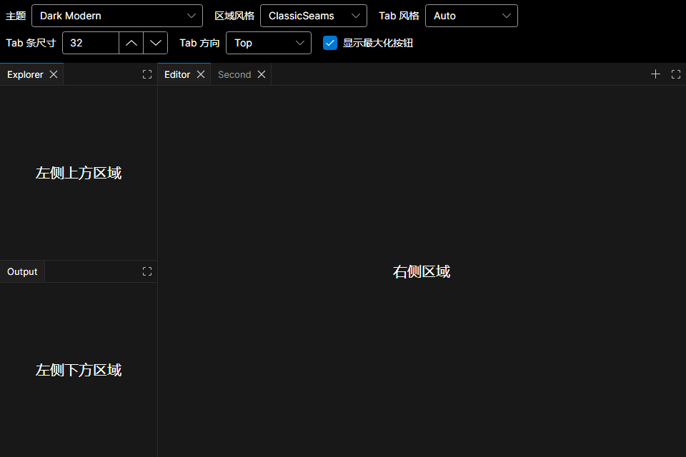
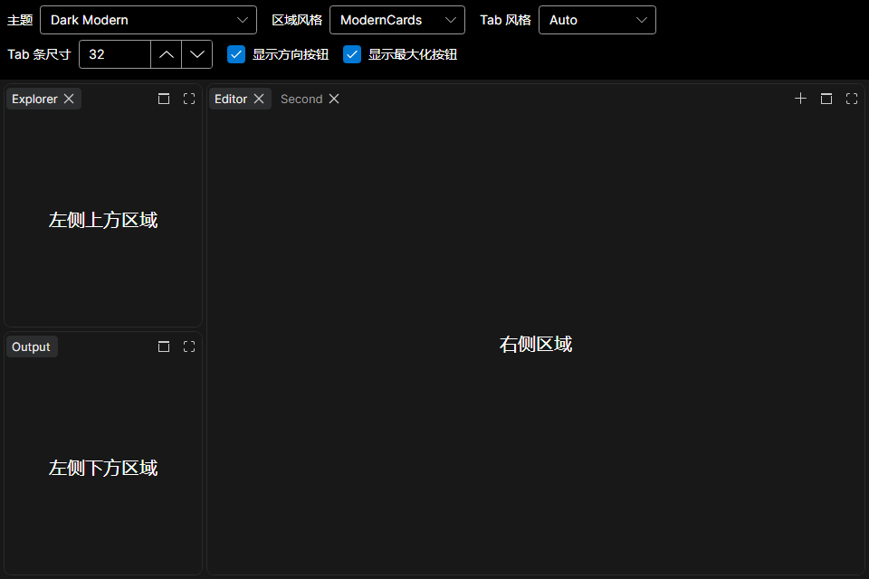
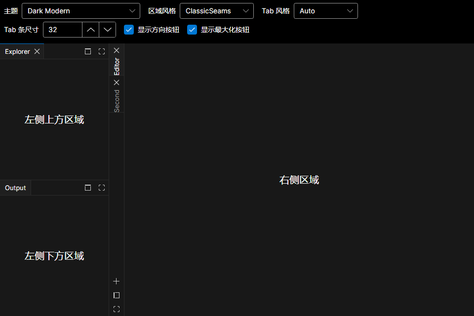

# Theming (3.0)

**One apply API:** assign [`DockShell.ColorTheme`](https://github.com/0use-TE/GOZA.Dock/blob/master/src/GOZA.Dock/Controls/DockShell.cs).

Each `DockShell` already includes `DockShellStyles` on itself. Loaders only produce a [`VsCodeColorTheme`](https://github.com/0use-TE/GOZA.Dock/blob/master/src/GOZA.Dock/VsCodeThemeJson.cs); they do **not** write resources.

```csharp
// Built-in
dockShell.ColorTheme = DockColorThemeCatalog.Create(DockColorTheme.DarkModern);

// External JSON (AOT: JsonDocument)
dockShell.ColorTheme = VsCodeThemeJson.LoadFromFile("themes/dark_modern.json");
// or LoadFromAsset(new Uri("avares://MyApp/Themes/dark.json"));
```

```xml
<DockShell ColorTheme="{Binding DockColorTheme}" />
```

| | Avalonia `ThemeVariant` | `DockShell.ColorTheme` |
|---|---|---|
| What | Fluent light/dark | Dock workbench brushes on **this shell** |
| Set by | **Host** (`RequestedThemeVariant`) | **`DockShell.ColorTheme`** |

```csharp
var theme = VsCodeThemeJson.LoadFromFile(path);
dockShell.ColorTheme = theme;
Application.Current!.RequestedThemeVariant =
    theme.IsDark ? ThemeVariant.Dark : ThemeVariant.Light;
```

When JSON omits `type`, resolution uses [`VsCodeThemeTypeMap`](https://github.com/0use-TE/GOZA.Dock/blob/master/src/GOZA.Dock/VsCodeThemeTypeMap.cs).

Color IDs: `VsCodeThemeColors` / [DOCK-THEMING.zh-CN.md](https://github.com/0use-TE/GOZA.Dock/blob/master/DOCK-THEMING.zh-CN.md).

## Header size (tab strip)

One property on **`DockShell`**: `TabStripSize` (default `32`).

- Horizontal tabs (top/bottom) → strip **height**
- Vertical tabs (left/right) → strip **width**

Title **font scales** with this value (`13 × strip/32`); horizontal padding stays fixed so tab **width grows with text**. Pill / chrome / close sizes are derived (`strip−8`, `strip−4`, …).

```xml
<DockShell TabStripSize="40" ColorTheme="{Binding DockColorTheme}" />
```

## Pane presentation

`DockShell.PanePresentation` is independent of `ColorTheme` and supports runtime switching:

```xml
<DockShell ColorTheme="{Binding DockColorTheme}"
           PanePresentation="{Binding PanePresentation}" />
```

- `ClassicSeams` (default): edge-to-edge panes and a one-pixel `editorGroup.border` seam using `sash.hoverBorder` on hover/drag.
- `ModernCards`: `surface.background`, `surface.border`, card gaps, and rounded pane corners.

`DockShell.SashSize` controls the transparent splitter hit target for mouse, pen, and touch. It defaults to `12`; the target is centered over the boundary and does not alter the one-pixel classic seam or the modern card gap.

## Tab presentation

`DockShell.TabPresentation` also switches at runtime without recreating tabs or hosted views:

```xml
<DockShell PanePresentation="ClassicSeams"
           TabPresentation="Auto" />
```

- `Auto` (default): `ClassicSeams` selects `ClassicTabs`; `ModernCards` selects `ModernPills`.
- `ClassicTabs`: legacy VS Code full-height rectangular tabs, 10px title inset, 28px action lane, one-pixel tab separators and active top/body rules.
- `ModernPills`: rounded inset tabs.

Set an explicit value to combine either tab style with either pane style. Classic tabs consume the standard VS Code keys `editorGroupHeader.tabsBackground`, `editorGroupHeader.tabsBorder`, `tab.activeBackground`, `tab.inactiveBackground`, `tab.activeForeground`, `tab.inactiveForeground`, `tab.hoverBackground`, `tab.hoverForeground`, `tab.border`, `tab.activeBorder`, and `tab.activeBorderTop`.

Non-closable classic tabs use balanced 10px horizontal title insets. Closable tabs use a 10px leading inset plus the 28px close-action lane. Header actions stay pinned to the trailing edge in the order Add → custom `HeaderContent` → tab placement → maximize/restore.

| ClassicSeams + Auto (default) | ModernCards + Auto |
|---|---|
|  |  |

Vertical classic tabs keep the 32px strip metric, center the compact rotated title-and-close group without spacer lanes, and pin Add → placement → maximize controls to the bottom edge. Their drag ghost uses the same orientation and live tab footprint:



You can still override the same keys manually in `DockShell.Resources` (`DockTabHeight`, …) — see [DOCK-THEMING.zh-CN.md](https://github.com/0use-TE/GOZA.Dock/blob/master/DOCK-THEMING.zh-CN.md).
