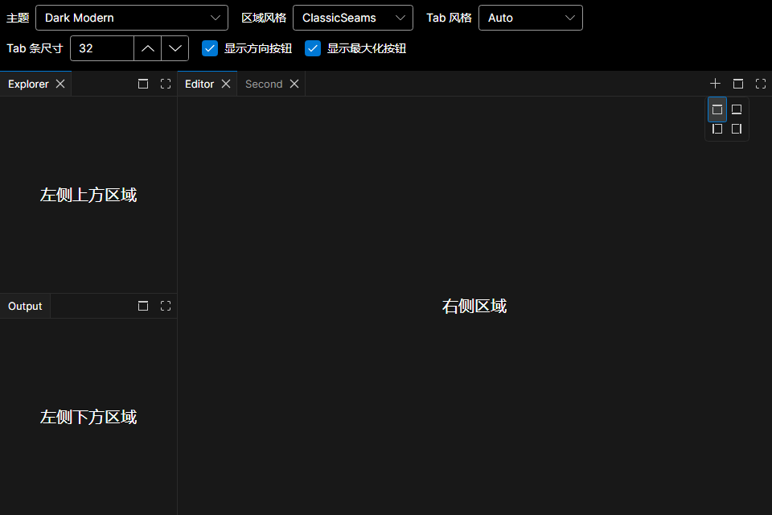

# 主题（3.0）

**唯一应用入口：** 给 [`DockShell.ColorTheme`](https://github.com/0use-TE/GOZA.Dock/blob/master/src/GOZA.Dock/Controls/DockShell.cs) 赋值。

每个 `DockShell` 已自带 `DockShellStyles`。加载器只返回 [`VsCodeColorTheme`](https://github.com/0use-TE/GOZA.Dock/blob/master/src/GOZA.Dock/VsCodeThemeJson.cs)，**不**写资源。

```csharp
// 内置
dockShell.ColorTheme = DockColorThemeCatalog.Create(DockColorTheme.DarkModern);

// 外置 JSON（AOT：JsonDocument）
dockShell.ColorTheme = VsCodeThemeJson.LoadFromFile("themes/dark_modern.json");
```

```xml
<DockShell ColorTheme="{Binding DockColorTheme}" />
```

| | Avalonia `ThemeVariant` | `DockShell.ColorTheme` |
|---|---|---|
| 作用 | Fluent 明暗 | **本 Shell** 上的 Dock workbench 笔刷 |
| 谁设置 | **宿主** | **`DockShell.ColorTheme`** |

```csharp
var theme = VsCodeThemeJson.LoadFromFile(path);
dockShell.ColorTheme = theme;
Application.Current!.RequestedThemeVariant =
    theme.IsDark ? ThemeVariant.Dark : ThemeVariant.Light;
```

JSON 缺少 `type` 时查 [`VsCodeThemeTypeMap`](https://github.com/0use-TE/GOZA.Dock/blob/master/src/GOZA.Dock/VsCodeThemeTypeMap.cs)。

## Header 尺寸（Tab 条）

`DockShell` 上只需一个属性：`TabStripSize`（默认 `32`）。

- 水平 Tab（上/下）→ 条的**高度**
- 垂直 Tab（左/右）→ 条的**宽度**

标题**字号随条尺寸缩放**（`13 × strip/32`）；左右 padding 固定，Tab **宽度由文字撑开**。Pill / chrome / 关闭按 `strip−8`、`strip−4` 推导。

```xml
<DockShell TabStripSize="40" ColorTheme="{Binding DockColorTheme}" />
```

## 区域表现模式

`DockShell.PanePresentation` 与 `ColorTheme` 相互独立，并支持运行时切换：

```xml
<DockShell ColorTheme="{Binding DockColorTheme}"
           PanePresentation="{Binding PanePresentation}" />
```

- `ClassicSeams`（默认）：区域贴边，常态显示 1px `editorGroup.border` 直缝；悬停/拖动使用 `sash.hoverBorder`。
- `ModernCards`：使用 `surface.background`、`surface.border`、卡片间距和区域圆角。

`DockShell.SashSize` 控制鼠标、触控笔和手指共用的透明拖动命中区，默认值为 `12`。命中区居中覆盖边界，不会改变经典模式的 1px 直缝或现代模式的卡片间距。

## Tab 表现模式

`DockShell.TabPresentation` 同样支持运行时切换，且不会重建 Tab 或已托管的 View：

```xml
<DockShell PanePresentation="ClassicSeams"
           TabPresentation="Auto" />
```

- `Auto`（默认）：`ClassicSeams` 自动选择 `ClassicTabs`，`ModernCards` 自动选择 `ModernPills`。
- `ClassicTabs`：旧版 VS Code 满高矩形 Tab，标题左缩进 10px、操作区 28px，并带 1px Tab 分隔线、选中顶部线和内容侧边线。
- `ModernPills`：现代圆角内缩 Tab。

显式指定后，两种 Tab 风格都能与任一区域风格组合。经典 Tab 直接使用标准 VS Code 键：`editorGroupHeader.tabsBackground`、`editorGroupHeader.tabsBorder`、`tab.activeBackground`、`tab.inactiveBackground`、`tab.activeForeground`、`tab.inactiveForeground`、`tab.hoverBackground`、`tab.hoverForeground`、`tab.border`、`tab.activeBorder`、`tab.activeBorderTop`。

不可关闭的经典 Tab 使用对称的 10px 左右标题留白；可关闭 Tab 使用 10px 起始留白和 28px 关闭操作区。Header 操作固定在尾端，顺序为 Add → 自定义 `HeaderContent` → Tab 位置 → 最大化/还原。

| ClassicSeams + Auto（默认） | ModernCards + Auto |
|---|---|
|  |  |

经典垂直 Tab 保持 32px 条宽，将紧凑的“标题 + 关闭按钮”旋转内容组整体居中，并复用水平 Tab 的标题/操作区间距，不添加额外占位区；Add → 位置 → 最大化操作固定到底部边缘，拖拽 Ghost 同步使用相同方向和真实 Tab 尺寸：


尾端的位置操作会打开紧凑的 2×2 方向选择器；其背景、边框、悬停、激活、图标与焦点颜色继续从现有 VS Code Workbench 资源键解析：



也可继续在 `DockShell.Resources` 里覆写同名键，见 [DOCK-THEMING.zh-CN.md](https://github.com/0use-TE/GOZA.Dock/blob/master/DOCK-THEMING.zh-CN.md)。
